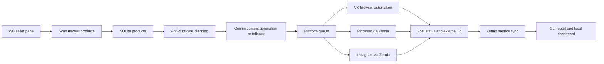

# WB Autoposter

MVP для автопостинга новинок Wildberries в соцсети. Проект сканирует новые карточки продавца WB, сохраняет товары и статусы публикаций в SQLite, генерирует короткие тексты для соцсетей, публикует посты и подтягивает соцметрики.

Текущий рабочий стек:

- WB: browser/public scan страницы продавца, без Seller API токенов.
- VK: browser automation через сохраненную VK-сессию.
- Pinterest: Zernio real publish.
- Instagram: Zernio real publish.
- Тексты: Gemini одним запросом на товар сразу для VK, Instagram и Pinterest, с fallback без падения пайплайна.
- Метрики: Zernio analytics для Pinterest/Instagram.

Что закрывает исходное ТЗ:

- папка проекта и README есть;
- MVP реально запускается через CLI, а не является презентацией;
- данные WB добываются через browser/public scan без Seller API;
- поддержаны VK, Pinterest и Instagram;
- экономика и roadmap описаны ниже.

## Как Это Работает

Обычный цикл:

```text
WB seller page
-> scan newest products
-> save/update products in SQLite
-> create planned posts without duplicates
-> generate/reuse social text
-> publish to selected platforms
-> save post status and external_id
-> sync social metrics from Zernio
```



Один товар публикуется максимум один раз в каждую площадку. Один и тот же товар может иметь отдельные посты VK, Pinterest и Instagram.

Для Instagram ссылка на WB не вставляется как основной CTA, потому что в обычном caption она не работает как нормальная кликабельная ссылка. Вместо этого добавляется `Артикул WB: <nmID>`. Для Pinterest WB-ссылка передается как destination link пина.

## Быстрый Старт

Установить зависимости:

```powershell
python -m pip install -e ".[dev]"
python -m playwright install chromium
```

Проверить тесты:

```powershell
python -m pytest
```

Быстрая проверка перед сдачей:

```powershell
powershell -ExecutionPolicy Bypass -File scripts\check_delivery.ps1
```

Подробный сценарий приемки лежит в `DELIVERY.md`.

Скопировать env:

```powershell
copy .env.example .env
```

Заполнить `.env` нужными значениями. Секреты и реальные ключи не коммитятся.

## Минимальный `.env`

Базовые поля:

```env
WB_AUTOPOSTER_DB_PATH=out/app.sqlite3
WB_AUTOPOSTER_OUT_DIR=out

GEMINI_API_KEY=
GEMINI_MODEL=gemini-2.5-flash
GEMINI_REQUEST_INTERVAL_SECONDS=6
GEMINI_429_COOLDOWN_SECONDS=60
CONTENT_RULES_PATH=config/content_rules.example.json

ZERNIO_API_KEY=
ZERNIO_ENABLE_REAL_PUBLISH=1
ZERNIO_PINTEREST_ACCOUNT_ID=
ZERNIO_PINTEREST_BOARD_ID=
ZERNIO_INSTAGRAM_ACCOUNT_ID=
ZERNIO_INSTAGRAM_CONTENT_TYPE=feed

VK_OWNER_ID=
VK_GROUP_ID=
VK_BROWSER_GROUP_URL=
VK_BROWSER_ENABLE=1
VK_BROWSER_STATE_PATH=out/vk_browser_state.json
VK_BROWSER_HEADLESS=0
VK_BROWSER_CONFIRM_BEFORE_POST=0

PINTEREST_POST_LIMIT_PER_RUN=1
INSTAGRAM_POST_LIMIT_PER_RUN=1
VK_POST_LIMIT_PER_RUN=1
```

`VK_OWNER_ID` для группы указывается с минусом. Например, для `https://vk.com/club239286699`:

```env
VK_OWNER_ID=-239286699
VK_GROUP_ID=239286699
VK_BROWSER_GROUP_URL=https://vk.com/club239286699
```

## Первичная Настройка

### 1. Проверить Zernio

```powershell
python -m wb_autoposter.cli zernio-check --platform pinterest
python -m wb_autoposter.cli zernio-check --platform instagram
```

Обе команды должны показать подключенный аккаунт и заполненные account/board ID.

### 2. Сохранить VK-сессию

Для реального VK-постинга один раз нужно войти в VK через браузер:

```powershell
python -m wb_autoposter.cli vk-browser-login --start-url "https://vk.com/club239286699" --no-headless
```

После логина должен появиться файл:

```text
out/vk_browser_state.json
```

Если этого файла нет, реальный VK-запуск остановится с ошибкой:

```text
VK browser session not found. Run vk-browser-login first.
```

### 3. Сделать baseline WB

Baseline нужен, чтобы не считать весь текущий ассортимент новинками.

```powershell
python -m wb_autoposter.cli wb-browser-baseline --seller-url "https://www.wildberries.ru/seller/trendsetter?sort=newly&page=1" --user-data-dir out\wb_chrome_profile_baseline --max-scrolls 350 --idle-scrolls 40 --scroll-delay-ms 2500
```

Для другого продавца заменить `--seller-url`. Если известен примерный размер каталога, можно дополнительно указать `--expected-count` как quality-check.

## Основной Запуск

### Безопасный dry-run

Dry-run проходит весь пайплайн, но не публикует реальные посты:

```powershell
python -m wb_autoposter.cli wb-social-cycle --seller-url "https://www.wildberries.ru/seller/trendsetter?sort=newly&page=1" --scan-limit 100 --user-data-dir out\wb_chrome_profile_baseline --vk --pinterest --instagram --pinterest-zernio --dry-run --vk-limit 1 --pinterest-limit 1 --instagram-limit 1 --headless --no-manual-ready
```

### Реальный запуск Pinterest + Instagram

```powershell
python -m wb_autoposter.cli wb-social-cycle --seller-url "https://www.wildberries.ru/seller/trendsetter?sort=newly&page=1" --scan-limit 100 --user-data-dir out\wb_chrome_profile_baseline --no-vk --pinterest --instagram --pinterest-zernio --no-dry-run --pinterest-limit 1 --instagram-limit 1 --headless --no-manual-ready
```

### Реальный запуск всех соцсетей

Перед этим должен существовать `out\vk_browser_state.json`.

```powershell
python -m wb_autoposter.cli wb-social-cycle --seller-url "https://www.wildberries.ru/seller/trendsetter?sort=newly&page=1" --scan-limit 100 --user-data-dir out\wb_chrome_profile_baseline --vk --vk-browser --pinterest --instagram --pinterest-zernio --no-dry-run --vk-limit 1 --pinterest-limit 1 --instagram-limit 1 --headless --no-manual-ready
```

### Отдельные команды по площадкам

VK:

```powershell
python -m wb_autoposter.cli wb-vk-cycle --seller-url "https://www.wildberries.ru/seller/trendsetter?sort=newly&page=1" --scan-limit 100 --user-data-dir out\wb_chrome_profile_baseline --browser --no-dry-run --limit 1
```

Pinterest:

```powershell
python -m wb_autoposter.cli wb-pinterest-cycle --seller-url "https://www.wildberries.ru/seller/trendsetter?sort=newly&page=1" --scan-limit 100 --user-data-dir out\wb_chrome_profile_baseline --zernio --no-dry-run --limit 1 --headless --no-manual-ready
```

Instagram:

```powershell
python -m wb_autoposter.cli wb-instagram-cycle --seller-url "https://www.wildberries.ru/seller/trendsetter?sort=newly&page=1" --scan-limit 100 --user-data-dir out\wb_chrome_profile_baseline --zernio --no-dry-run --limit 1 --headless --no-manual-ready
```

## Проверка Результата

Посмотреть статусы товаров и постов:

```powershell
python -m wb_autoposter.cli status
python -m wb_autoposter.cli report
```

Синхронизировать соцметрики Pinterest/Instagram:

```powershell
python -m wb_autoposter.cli sync-metrics --platform all --limit 50
python -m wb_autoposter.cli metrics-report --platform all --limit 20
```

Если Zernio возвращает `pending`, это нормально: метрики у свежего поста могут быть еще не готовы. Повторный запуск позже сохранит новый снимок.

## Генерация Текстов

Gemini используется только как улучшение текста. Если ключа нет, JSON не распарсился, ответ не подходит карточке или пришел `429 Too Many Requests`, пайплайн не падает и использует fallback-тексты.

Важные правила:

- один товар = один Gemini-запрос;
- один ответ содержит тексты сразу для `vk`, `instagram`, `pinterest`;
- если текст уже сохранен в payload и товар не изменился, повторный запуск не дергает Gemini заново;
- `GEMINI_REQUEST_INTERVAL_SECONDS` задает паузу между запросами по разным товарам;
- `GEMINI_429_COOLDOWN_SECONDS` задает cooldown после rate limit.

Правила текста можно менять без правки кода через:

```env
CONTENT_RULES_PATH=config/content_rules.example.json
```

В этом файле настраиваются запретные фразы, generic marketplace-бренды, SEO stopwords и заблокированные хэштеги.

## Соцметрики

Сейчас соцметрики считаются через Zernio analytics:

- Pinterest: impressions, clicks, saves и другие доступные поля.
- Instagram: reach/views/likes/comments/saves. Переходы по WB-ссылке из caption честно не считаются кликабельным трафиком.

Redirect tracking сейчас не используется: WB-ссылки остаются прямыми или с UTM, без подозрительного промежуточного домена.

## Локальный Dashboard

Проект рассчитан на автономную работу без постоянного оператора. Поэтому полноценная админ-панель не нужна для MVP.

Для контроля можно сформировать статический HTML-отчёт:

```powershell
python -m wb_autoposter.cli export-dashboard
```

Результат:

```text
out/dashboard.html
```

Путь можно переопределить:

```powershell
python -m wb_autoposter.cli export-dashboard --output out/dashboard.html
```

В отчёте видно:

- сколько постов `planned` / `published` / `failed` / `dry_run_published`;
- статусы по VK, Pinterest и Instagram;
- последние публикации;
- ошибки публикации;
- последние метрики, если они уже синхронизированы через Zernio.

Это не ручная админ-панель, а лёгкий отчёт для контроля автономной системы. Если метрик ещё нет, сначала выполните:

```powershell
python -m wb_autoposter.cli sync-metrics
```

## Экономика

Задача проекта - не просто публиковать посты, а проверить, дает ли внешний трафик на WB экономический смысл.

As-is без автоматизации:

- менеджер вручную ищет новые карточки WB;
- вручную копирует фото, название, цену и ссылку;
- пишет отдельный текст под соцсеть;
- публикует пост;
- руками проверяет, что уже опубликовано;
- метрики собираются нерегулярно или не связываются с конкретным товаром.

Оценка ручного процесса: 5-10 минут на один товар. Если выходит 30 новинок в месяц, это 2.5-5 часов ручной работы только на публикации, без аналитики и без контроля дублей.

To-be с проектом:

- скрипт сам сканирует новинки WB;
- дубли отсекаются через SQLite;
- текст формируется автоматически из карточки товара;
- публикация идет в VK/Pinterest/Instagram с лимитами;
- статусы и ошибки сохраняются;
- соцметрики Pinterest/Instagram подтягиваются через Zernio.

Прямые расходы MVP:

- Zernio: зависит от тарифа и числа подключенных аккаунтов; для пилота можно использовать бесплатный/минимальный тариф, если он покрывает нужные аккаунты и лимиты.
- Gemini: для небольшого объема запросов можно начать с бесплатного лимита; при росте объема нужен платный лимит или более жесткий throttling.
- Сервер/ПК: 0 ₽, если запускать локально на рабочем Windows-ПК; ориентир 1000-2500 ₽/мес, если нужен VPS/Windows-сервер под регулярный запуск.
- Домен/redirect/short links: сейчас не нужны, потому что соцметрики считаются через Zernio, а WB-ссылки остаются прямыми.
- Поддержка: закладывать время на мониторинг, обновление селекторов WB/VK browser automation и корректировку текстовых правил.

Вторичные расходы:

- прогрев и ведение соцсетей: без живых аккаунтов и регулярного контента внешний трафик будет слабее;
- модерация и визуальная проверка первых публикаций;
- корректировка контента под бренд;
- разбор ошибок публикации и лимитов площадок;
- возможная миграция на сервер, если локальный ПК не подходит.

Условная окупаемость считается так:

```text
прибыль = переходы * конверсия WB * маржа с заказа
окупаемость = прибыль - ежемесячные расходы
```

Пример: если маржа с заказа 600 ₽, конверсия внешнего трафика в заказ 1%, то один переход в среднем дает 6 ₽ ожидаемой маржи. Чтобы окупить 1500 ₽/мес инфраструктуры и поддержки, нужно примерно 250 качественных переходов в месяц. Если постинг дает меньше, проект полезен как контент-автоматизация и проверка канала, но не как самостоятельный источник продаж.

Вывод для пилота: запускать стоит, если у бренда регулярно появляются новинки и есть готовность вести соцсети хотя бы 1-2 месяца. Главная метрика пилота - не количество постов, а связка `публикации -> охват/клики/сохранения -> переходы/заказы WB`.

## Регулярный Запуск

Для Windows есть готовые скрипты:

```powershell
powershell -ExecutionPolicy Bypass -File scripts\run_social_cycle.ps1 -SellerUrl "https://www.wildberries.ru/seller/trendsetter?sort=newly&page=1" -RealPublish
powershell -ExecutionPolicy Bypass -File scripts\run_social_cycle.ps1 -SellerUrl "https://www.wildberries.ru/seller/trendsetter?sort=newly&page=1" -RealPublish -IncludeVk
powershell -ExecutionPolicy Bypass -File scripts\sync_metrics.ps1
```

Создать Windows Scheduled Tasks:

```powershell
powershell -ExecutionPolicy Bypass -File scripts\install_windows_tasks.ps1 -SellerUrl "https://www.wildberries.ru/seller/trendsetter?sort=newly&page=1" -RealPublish -Force
```

`scripts\run_social_cycle.ps1` без `-RealPublish` запускает dry-run. VK в этом скрипте выключен по умолчанию и включается флагом `-IncludeVk`; перед этим должен существовать `out\vk_browser_state.json`.

Для Linux/macOS пример лежит в:

```text
scripts/cron.example
```

## Файлы И Артефакты

Основные файлы:

- `out/app.sqlite3` - локальная SQLite-база.
- `out/wb_browser_new_scan_products.json` - последний результат WB scan.
- `out/zernio_post_*.json` - request/response реальной публикации через Zernio.
- `out/vk_browser_state.json` - сохраненная VK-сессия.
- `out/vk_browser_media/` - скачанные фото перед VK browser publish.
- `out/vk_browser_debug/` - debug-артефакты при ошибках VK automation.
- `config/content_rules.example.json` - пример правил текста.

`out/` можно удалить, но если удалить `out/vk_browser_state.json`, придется снова выполнить `vk-browser-login`.

## Частые Проблемы

### `VK browser session not found`

Нужно один раз выполнить:

```powershell
python -m wb_autoposter.cli vk-browser-login --start-url "https://vk.com/club239286699" --no-headless
```

### Gemini `429 Too Many Requests`

Это rate limit. Проект включит cooldown и продолжит через fallback. Для более мягкого режима увеличить:

```env
GEMINI_REQUEST_INTERVAL_SECONDS=10
GEMINI_429_COOLDOWN_SECONDS=120
```

### Новых товаров нет

Это нормальный результат. Значит WB scan не нашел nmID, которых еще нет в базе:

```text
New nmIDs detected: 0
```

Если нужно проверить публикацию прямо сейчас, можно использовать уже planned-посты в базе или временно снизить baseline/использовать тестовую базу.

### Zernio metrics pending

У свежих постов аналитика может быть еще не готова. Запустить позже:

```powershell
python -m wb_autoposter.cli sync-metrics --platform all --limit 50
```

## Тесты

```powershell
python -m pytest
```

Текущий набор покрывает CLI, WB sources, storage, publishers, Zernio metrics, content generation, SEO/text rules и browser-related контракты.

## Roadmap

1. Стабилизация пилота: прогнать 3-7 дней регулярного запуска, проверить антидубли, Zernio-статусы, VK browser session и Gemini fallback.
2. Контент: посмотреть 20-30 реальных публикаций, ужесточить `config/content_rules.example.json`, убрать слабые CTA и лишние хэштеги.
3. Метрики: добавить регулярный `sync-metrics`, недельный CSV/JSON отчет и сравнение постов по reach/clicks/saves.
4. Операторский web-admin: список товаров, очередь публикаций, ошибки, повтор публикации, ручной skip, просмотр текстов и метрик.
5. Надежный scheduler: вынести запуск на Windows VPS/сервер или отдельный рабочий ПК, добавить логи и уведомления об ошибках.
6. Источник WB: при появлении доступов подключить Seller API или импорт CSV/XLSX из кабинета WB как более стабильный источник новинок.
7. VK production path: если VK станет важным каналом, заменить browser automation на официальный OAuth/API-путь с корректной загрузкой фото.
8. Pinterest/Instagram развитие: протестировать разные доски/форматы, reels/stories/carousel через Zernio, отдельные лимиты и тексты под канал.
9. Атрибуция продаж: если бизнесу нужны именно заказы, договориться о доступе к WB-аналитике/отчетам и связать периоды публикаций с продажами.
10. Развитие под компанию: сезонные кампании, разные правила для категорий одежды, расписание по площадкам, стоп-лист товаров и отчетность для команды бренда.
